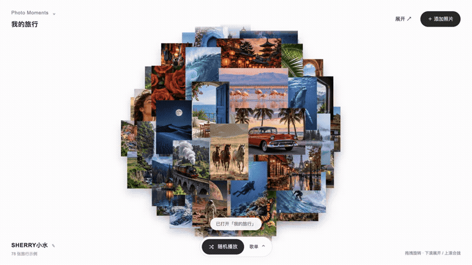
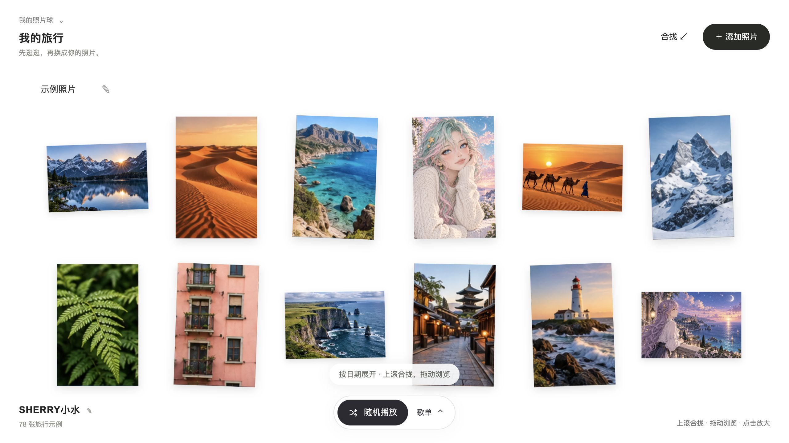
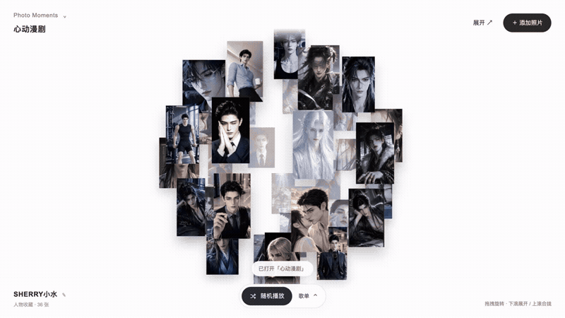
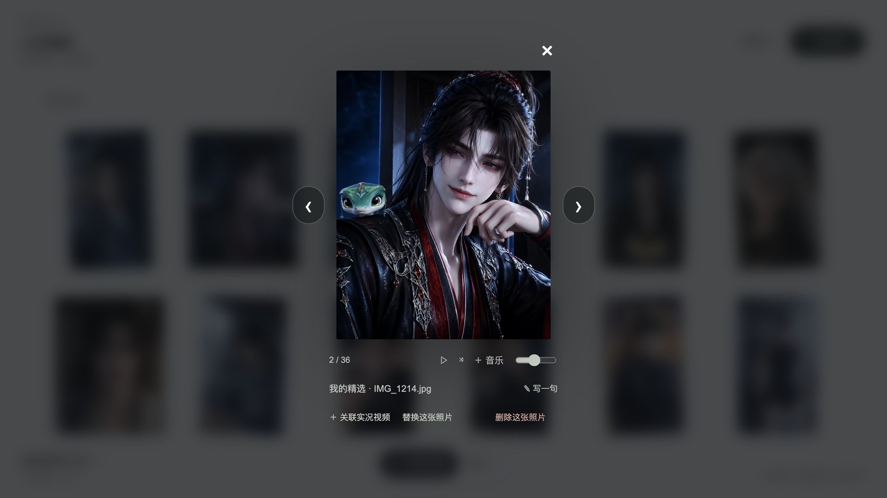

<div align="center">

# Photo Moments

**把喜欢的照片，变成可以拨动、展开、听歌的记忆球。**

适用于 **豆包工作 · WorkBuddy · Codex · Claude Code** 等支持 Agent Skills、文件操作与项目运行的 AI Agent。

[观看演示](#两种相册两种心动) · [制作同款](#开始制作同款) · [使用说明](#网页怎么用) · [修改自己的版本](#在同款基础上修改) · [下载 Skill](https://github.com/XshuiAi/photo-moments/releases/latest)

[](LICENSE)
[](SKILL.md)

</div>


旅行结束后，把沿途的风景放进来；遇到喜欢的人物，把那些心动的画面收藏起来。拖动鼠标，照片跟着球体转动；滚动滚轮，照片从球体展开成一面照片墙；点开一张，就能一边听音乐，一边左右翻看。

**Photo Moments 提供完整网页模板与 Skill。** 你可以先让 AI Agent 做出与演示相同的页面，再换成自己的照片、音乐、名字和配色。无需从零描述界面，也无需自己编写代码。

## 两种相册，两种心动

以下 GIF 和视频来自本项目实际页面操作。GIF 无声；MP4 配有内置示例音乐。两组示例都包含在模板里，可从左上角“我的照片球”切换。

### 旅行回忆

**适合：节假日出游、毕业旅行、日常散步、值得留下的一天。**

78 张旅行示例组成照片球。转一转回看风景，展开后按日期浏览；导入自己的照片，再选一首歌，就有了自己的旅行相册。



**[▶ 观看旅行回忆视频（含音乐）](docs/demos/travel.mp4)**



试着对 Agent 说：

```text
使用 Photo Moments，先打开旅行回忆示例，保留现在的动效和布局。
然后帮我新建一个叫“夏天的海”的空白相册，我会上传自己的旅行照片。
署名改成我的名字。日期可以保留，地点和心情不用强制填写。
```

### 心动漫剧

**适合：人物壁纸、古风与现代角色收藏、插画作品、审美灵感相册。**

36 张人物图片组成独立照片球。展开挑选喜欢的角色，点击放大，使用左右箭头继续浏览；随机播放配乐，打开歌单可以查看当前曲目和选择音乐。



**[▶ 观看心动漫剧视频（含音乐）](docs/demos/drama.mp4)**



试着对 Agent 说：

```text
使用 Photo Moments，先做出心动漫剧示例的同款效果。
保留人物照片球、滚轮展开合拢、大图左右切换、随机音乐和歌单。
先让我看完整示例，再用我提供的壁纸替换其中几张。
```

> 示例素材用于效果展示；图片和音乐不属于代码的 MIT 授权范围，详见[素材声明](ATTRIBUTION.md)。

## 你会得到什么

| 能力 | 使用效果 |
|---|---|
| 360° 照片球 | 鼠标拖拽旋转，从不同方向查看照片 |
| 球体与照片墙切换 | 下滚展开，上滚合拢，也可点右上角按钮 |
| 大图浏览 | 点击照片放大，左右箭头、键盘方向键或滑动切换 |
| 两组内置案例 | 旅行回忆与心动漫剧分别管理照片和音乐 |
| 自己的相册 | 输入名字、新建相册、上传或拖入照片 |
| 单张替换 | 在大图界面替换当前照片，保留其他照片 |
| 照片管理 | 支持单张删除与批量删除，没有回收站 |
| 一句话日记 | 给照片或某一天写心情，日期、地点按需记录 |
| 实况照片 | 给照片关联视频，点击实况播放画面与原声 |
| 音乐氛围 | 随机播放、歌单选曲、添加自己的音乐、调节音量 |
| 本地保存 | 同一浏览器内保存相册，支持导出及导入备份 |
| 持续定制 | 拿到完整项目文件，继续用自然语言让 Agent 修改 |

## 开始制作同款

### 方式一：把仓库地址发给 AI Agent

适合能下载仓库、读写本地文件并运行项目的 Agent。复制下面这段：

```text
请安装并使用 Photo Moments：
https://github.com/XshuiAi/photo-moments

先读取 SKILL.md，获取完整模板、图片和音乐，不能只读取介绍页面。
在独立项目副本中运行，先完整做出仓库里的两个案例，保留现有布局和交互，
不要重新设计，也不要重新生成示例素材。
检查旋转、滚轮展开合拢、大图左右切换、随机音乐与歌单，
最后给我实际可打开的预览入口和项目文件位置。
先让我看到同款，再根据我的要求修改。
```

当前仓库保持私有，直接读取需有访问权限。没有仓库权限时，请采用下面的下载导入方式，不要把 GitHub 密码或令牌粘贴到聊天里。

### 方式二：下载 Skill 后导入

1. 打开[下载页](https://github.com/XshuiAi/photo-moments/releases/latest)，下载 **Photo-Moments.zip**。
2. 在 Agent 的技能管理中导入；若要求文件夹，先解压，选择包含 `SKILL.md` 的 `photo-moments` 文件夹。
3. 新建工作任务，选择 Photo Moments，发送：

```text
使用 Photo Moments，完整运行内置模板。
保留两组示例照片、音乐、布局和全部交互，不重新设计。
在独立副本中启动预览，给我可以打开的入口。
先做出同款，等我看过后再修改。
```

**完整包需要保留 `assets`、`scripts`、`references` 和校验清单。只上传 SKILL.md，不能得到完整同款。**

## 在不同 AI Agent 中使用

| Agent | 安装入口 | 如何调用 |
|---|---|---|
| 豆包工作 | 技能管理 → 新建 → 上传技能；按界面要求上传 ZIP 或解压目录 | 在新任务中选中技能，发送“使用 Photo Moments…” |
| WorkBuddy | 技能页面 → 添加技能 → 导入本地技能包 | 选择该技能，或在任务中明确说“使用 Photo Moments…” |
| Codex | 让 Codex 安装仓库，或把完整目录放入其技能目录 | 新会话中输入 `$photo-moments` 并描述目标 |
| Claude Code | 将完整目录放入 `~/.claude/skills/photo-moments/` | 输入 `/photo-moments`，后接你的需求 |

平台需要提供文件读写、Python 3.9+ 和网页预览或本地服务能力。**本项目已在本机运行并验证交互；豆包工作、WorkBuddy、Claude Code 的实际导入与运行仍需在对应环境验证。** 技能格式兼容不代表每个平台都已完成实机测试。

详细步骤、命令与平台官方说明见[安装指南](docs/INSTALL.md)。

## 网页怎么用

### 1. 留下你的名字

第一次进入时输入名字，它会显示在页面左下角。以后点击名字即可进入相册设置。顶部保留主要功能，底部中间是音乐入口，右下角提示当前操作方式。

### 2. 先逛示例，或新建自己的相册

点击左上角“我的照片球”，切换旅行回忆和心动漫剧。也可以创建空白相册，给一次旅行、一个喜欢的主题或一段时间单独收藏。各相册分别保存照片、心情和音乐。

### 3. 添加照片与替换照片

- **添加**：点“添加照片”，选择多张照片，或把文件拖入导入框。新照片追加到当前相册。
- **替换**：先点开目标照片，再点“替换这张照片”，只替换当前这一张。
- **避免重复**：导入时会检查重复图片；不会为凑数量反复加入同一文件。
- **日期**：可以优先读取照片的拍摄日期；读不到时使用导入界面选择的日期。

常规图片建议使用 JPG、PNG 或 WebP。原图越清晰，放大效果越好；网页不会把低分辨率图片自动变成高清原片。

### 4. 旋转、展开与翻看

拖动球体可以改变观看方向。向下滚动展开照片墙；向上滚动，在照片墙回到顶部后可合拢。展开后按日期及相册中的顺序浏览。

点击照片进入大图。使用两侧箭头或键盘左右键切换，也可以左右滑动。关闭大图后回到相册。大图内也有音乐控制，不需要退出才能换歌。

### 5. 想写就写，不写也可以

放大照片后点击“写一句”，或双击照片，记录当时的心情。可以只留一句话和日期，没有地点也可以。展开的旅行相册中，还可从日期入口记录当天的心情。

### 6. 让实况照片动起来

实况需要**一张静态照片和一段对应视频**。同时导入同名照片与 MOV/MP4 可配对；也可以点开照片后选择“关联实况视频”。关联成功后，点击实况按钮播放画面和原声。

只有一张 JPG/PNG 时没有动态部分。不同设备的 HEIC/HEVC 支持情况不同：macOS 本机可使用系统图片转换；视频转换需要 ffmpeg。不支持时，导出 JPG 与 H.264/AAC MP4 再导入即可。

### 7. 一边听歌，一边看照片

点底部的“随机播放”开始播放并随机换曲。点“歌单”，可以看到曲目和正在播放的歌曲，手动选歌、添加自己的音乐、调节音量。旅行与漫剧分别有示例配乐。

首次播放需要点击按钮，浏览器不会默认自动出声。GIF 演示没有声音，可看 MP4 演示或打开网页体验。

### 8. 删除与备份

大图里可以删除单张；从左下角名字进入照片管理，可选择多张批量删除。**删除没有恢复功能。**

相册默认保存在当前浏览器里。换设备、换浏览器或清理数据前，在设置中导出备份；在新环境中导入备份继续使用。备份恢复可能替换当前相册，请先保留当前备份。

## 在同款基础上修改

先运行示例，再给 Agent 一项明确的修改要求。以下口令可以直接用：

| 想改什么 | 可以这样说 |
|---|---|
| 名字和标题 | “署名改成小林，相册叫我的周末，其他不动。” |
| 换几张图 | “用我提供的这三张图替换我选中的照片，其余照片保留。” |
| 全部用自己的图 | “新建空白相册，只放我上传的旅行照片，保留原示例相册。” |
| 背景与按钮 | “背景改为暖白，按钮改为墨绿，保留现在的布局、字号和动效。” |
| 改成摄影作品集 | “用我的摄影作品做独立相册，保留大图切换和音乐，标题改成我的作品。” |
| 调整球体 | “旋转慢一点，照片之间疏一点，保留鼠标拖拽和滚轮展开合拢。” |
| 自己的歌单 | “用我上传的音乐作为这个相册的歌单，保留随机播放和音量控制。” |
| 手机布局 | “优化手机竖屏的照片尺寸和按钮间距，不改变桌面版。” |

如果自己编辑文件：页面文字在 `index.html`，外观在 `app.css`，交互在 `app.js`，内置素材在各图片与音乐清单及 `assets/` 中。始终修改生成的项目副本，保留原模板方便再次制作同款。详见[定制指南](docs/CUSTOMIZE.md)。

## 常见问题

**下载后是不是双击就能用？** 这个项目包通过本地服务打开，Agent 会帮你启动。手动操作见[安装指南](docs/INSTALL.md)。直接双击 `index.html` 可能受浏览器文件限制影响，尤其是音乐加载。

**需要购买 API 或配置生图模型吗？** 运行内置网页无需 API Key，不会额外调用生图服务。使用 AI Agent 的费用由对应平台决定。

**豆包不能读取 GitHub 链接怎么办？** 私有仓库需授权；网络受限时下载完整 ZIP 后导入。若技能包超出平台大小限制，让有权限的 Agent 获取完整仓库，或在本地运行，不要删掉素材假装导入成功。

**发 localhost 链接，朋友能打开吗？** 不能。它是运行项目那台机器的地址。可以把项目交给朋友本地运行，或另行部署网站；当前仓库没有自动开启公开网站。

**每个人用的是同一份相册吗？** 每个人在自己的浏览器里保存数据；修改不会自动同步给别人。当前没有账号、云同步或多人协作。

**我自己的照片会上传到 GitHub 吗？** 页面导入的照片保存在浏览器中，不会自动推送到仓库。如果把素材交给 AI Agent，素材处理范围取决于该 Agent 的权限与隐私设置。

**更新后我的相册会丢失吗？** 先导出备份再更新。保持旧项目副本；不要覆盖自己的相册数据或把示例模板当作个人备份。

## 作者与许可

**Sherry小水 · AI 博主 / AI Builder**

[GitHub](https://github.com/XshuiAi) · [抖音](https://v.douyin.com/9_PhmenzPd4/) · [小红书](https://xhslink.com/m/11P8CyKlR2D)

代码、Skill 指令及说明文档采用 [MIT License](LICENSE)，使用和修改时保留版权与许可声明。**MIT 不覆盖示例照片、人物作品、音乐、截图及演示视频中的第三方内容**；对应权利与来源见 [ATTRIBUTION.md](ATTRIBUTION.md)。对外分享自己的相册时，请使用自己拥有或获准使用的素材。

[更新记录](CHANGELOG.md) · [反馈问题](https://github.com/XshuiAi/photo-moments/issues)
